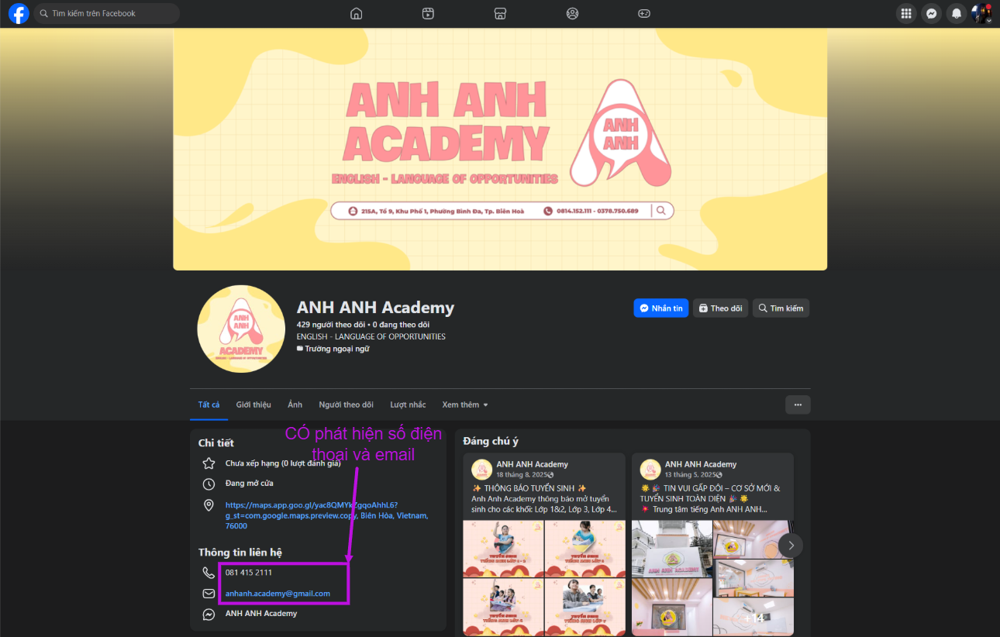
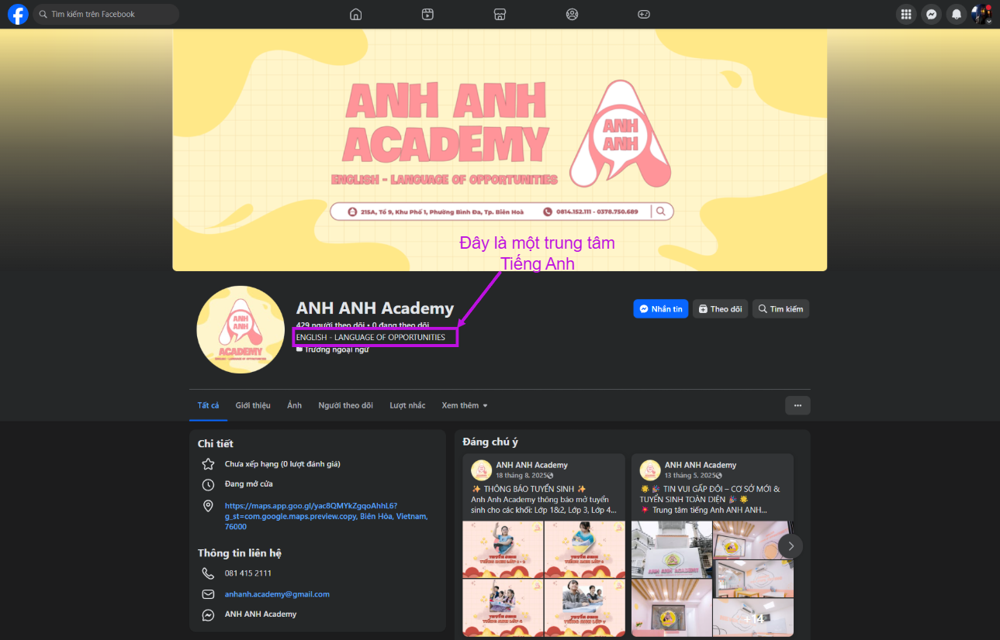

# Business Directory Builder

 

`Business Directory Builder` là một workflow n8n được thiết kế để tự động hoá quy trình thu thập thông tin trung tâm ngoại ngữ; đồng thời có thể mở rộng để phân loại khách hàng/doanh nghiệp theo ngành nghề, phục vụ phân tích và chăm sóc khách hàng được công ty công nghệ và truyền thông [Pmedia](https://pmedia.vn/) sáng tạo và phát triển.

## Nhà phát triển

 

  <!-- Left -->
  

    
SERVICES

    
What I do

    

      Chúng tôi là công ty giúp giải quyết 
      vấn đề về Marketing Online của bạn.
    

  

  <!-- Middle -->
  

    
Khách hàng là số 1

    
Chúng tôi không chỉ cung cấp sản phẩm và dịch vụ, mà còn xây dựng mối quan hệ vững chắc với khách hàng. Bằng cách lắng nghe và hiểu rõ nhu cầu, chúng tôi cam kết mang lại giải pháp tối ưu và duy trì một môi trường giao tiếp tự do.

    
Hành động minh bạch

    
Minh bạch và trung thực là nguyên tắc mà chúng tôi đặt lên hàng đầu. Từ thông tin sản phẩm đến quyết định chiến lược, chúng tôi cung cấp mọi thông tin một cách rõ ràng để xây dựng niềm tin và sự tin tưởng từ phía khách hàng và đối tác.

  

  <!-- Right -->
  

    
Sáng tạo mỗi ngày

    
Pmedia cam kết mang lại những sản phẩm và dịch vụ có chất lượng độc đáo và sáng tạo, tạo nên một hình ảnh thương hiệu đặc biệt. Chiến lược tiếp thị của chúng tôi được xây dựng để làm nổi bật sự khác biệt trên thị trường.

    
Đoàn Kết Mạnh Mẽ Hơn

    
Sự đoàn kết là nền tảng của mọi hoạt động trong công ty. Tại đây, chúng tôi tạo ra một môi trường làm việc tích cực, hỗ trợ và khuyến khích sự đồng lòng và hợp tác giữa các thành viên trong đội ngũ.

  

---

## Các tính năng chính

1. **Thu thập thông tin doanh nghiệp linh hoạt**  
   Tự động thu thập dữ liệu của trung tâm ngoại ngữ hoặc bất kỳ doanh nghiệp nào theo nhu cầu của người dùng (tên, liên hệ, website/mạng xã hội, mô tả dịch vụ, khu vực hoạt động, ...).

2. **Phân loại doanh nghiệp theo ngành nghề**  
   Dựa trên các thông tin đã thu thập, hệ thống tiến hành phân tích và gắn nhãn ngành nghề phù hợp (ví dụ: trung tâm ngoại ngữ, giáo dục, dịch vụ, bán lẻ, ...), giúp dữ liệu được tổ chức rõ ràng và dễ khai thác cho các mục đích tiếp theo.

---

## Hình thức thu thập thông tin

### 1) Thu thập từ Google Maps (`UTPGMapScraperPro`)

Dữ liệu nền tảng (bản gốc) được lấy từ `UTPGMapScraperPro`, bao gồm các trường như: `Name`, `Catagory`, `Address`, `State`, `Location`, và các liên kết (nếu có) như `Facebook`, `Website`.

**Ví dụ record bản gốc** (thu thập từ `UTPGMapScraperPro`):

| Name            | Mobile Number | Catagory           | Address                                                  | Email Id | State    | Location | Facebook                                               | Website |
| --------------- | ------------: | ------------------ | -------------------------------------------------------- | -------- | -------- | -------- | ------------------------------------------------------ | ------- |
| Anh Anh Academy |     814152111 | Trung tâm giáo dục | 87 Phạm Văn Thuận, Bình Đa, Biên Hòa, Đồng Nai, Việt Nam |          | Việt Nam | Đồng Nai | https://www.facebook.com/profile.php?id=61573642955385 |         |

### 2) Mở rộng nguồn bằng liên kết (scrape website/Facebook)

Từ các liên kết trích xuất được trên Google Maps (ví dụ `Facebook`, `Website`), workflow lần theo các đường dẫn này để **scrape và bổ sung dữ liệu**.

Trong ví dụ này, record **thiếu `Website`**, nên không thể scrape website; tuy nhiên vẫn có thể mở rộng từ liên kết `Facebook`.

### 3) Bổ sung thông tin công khai từ Facebook

Từ trang Facebook được liên kết, có thể thu thập thêm các thông tin công bố công khai như:

- Số điện thoại
- Email

Sau khi thu thập được từ Facebook, điền lại vào record:

| Name            | Mobile Number          | Catagory           | Address                                                  | Email Id                 | State    | Location | Facebook                                               | Website | Notes |
| --------------- | ---------------------- | ------------------ | -------------------------------------------------------- | ------------------------ | -------- | -------- | ------------------------------------------------------ | ------- | ----- |
| Anh Anh Academy | 0378750689, 0814152111 | Trung tâm giáo dục | 87 Phạm Văn Thuận, Bình Đa, Biên Hòa, Đồng Nai, Việt Nam | anhanh.academy@gmail.com | Việt Nam | Đồng Nai | https://www.facebook.com/profile.php?id=61573642955385 |         |       |

---

## Hình thức phân loại

### Tiêu chí phân loại trung tâm (doanh nghiệp)

1. **Tên**  
   Lấy từ dữ liệu thu thập qua `UTPGMapScraperPro` (tên hiển thị trên Google Maps).

2. **Loại danh mục**  
   Lấy từ `UTPGMapScraperPro` và thường là thông tin do doanh nghiệp chủ động thiết lập/cập nhật trên Google Maps (ví dụ: Trung tâm ngoại ngữ, Cơ sở giáo dục, Training center, ...).

3. **Thông tin phân loại bổ sung do nhân viên gắn nhãn (bán tự động)**  
   Dựa trên dữ liệu thu thập được từ website/mạng xã hội/liên kết liên quan (mô tả dịch vụ, chương trình đào tạo, bài viết, thông tin tuyển sinh, ...), nhân viên (hoặc workflow hỗ trợ) thực hiện chuẩn hoá và gắn nhãn bổ sung để tăng độ chính xác và phục vụ khai thác dữ liệu.

---

## Ví dụ cho tiêu chí 3

- **Nguồn phân tích:** mô tả trên website, fanpage Facebook, nội dung bài viết, danh sách khoá học, thông tin tuyển sinh.
- **Nhãn gợi ý có thể gắn:** Tiếng Anh / Tiếng Hàn / Tiếng Trung / Tiếng Nhật / Tiếng Đức / Tiếng Pháp / Nhiều ngôn ngữ / ...

### Minh hoạ: gắn nhãn `Notes` từ Facebook

Truy cập trang Facebook được liên kết với **Anh Anh Academy** sẽ thấy các thông tin như hình bên dưới:

Từ đây có thể suy ra đây là một trung tâm dạy **`Tiếng Anh`**. Thông tin này có thể được bổ sung vào cột `Notes` trong record:

| Name            | Mobile Number          | Catagory           | Address                                                  | Email Id                 | State    | Location | Facebook                                               | Website | Notes       |
| --------------- | ---------------------- | ------------------ | -------------------------------------------------------- | ------------------------ | -------- | -------- | ------------------------------------------------------ | ------- | ----------- |
| Anh Anh Academy | 0378750689, 0814152111 | Trung tâm giáo dục | 87 Phạm Văn Thuận, Bình Đa, Biên Hòa, Đồng Nai, Việt Nam | anhanh.academy@gmail.com | Việt Nam | Đồng Nai | https://www.facebook.com/profile.php?id=61573642955385 |         | `Tiếng Anh` |

**Thứ tự ưu tiên của các thông tin:** `Notes` > (`Name` + `Catagory`) > `Name` > `Catagory`  
Nếu mẫu thông tin nào có mức độ ưu tiên càng cao thì sẽ càng được phân loại vào ngành nghề tương ứng.

---

## Các hạn chế

1. Quy trình mang tính **bán tự động**, chưa thể hoàn toàn tự động hóa để thực hiện phân loại và thu thập thông tin.
2. Chính sách bảo vệ người dùng của Facebook và các nền tảng mạng xã hội thường nghiêm ngặt đối với việc thu thập dữ liệu của các cá nhân/tổ chức thuộc diện **`riêng tư`**.
3. Phụ thuộc vào ít nhất một liên kết như **website** hoặc **Facebook** (hoặc mạng xã hội tương tự). Nếu record không có bất kỳ đường link nào để khai thác thì sẽ không thể mở rộng dữ liệu (**Hạn chế trầm trọng 🚨🚨**).
4. Không phải lúc nào dữ liệu cũng được công bố khi scrape từ **Facebook** và **website**. Các đường liên kết có thể được truy cập bằng tự động hóa nhưng sau khi truy cập, dữ liệu vẫn có thể bị che đi hoặc không công bố (có thể do cá nhân hoặc doanh nghiệp không công khai thông tin lên mạng xã hội).

---

## Các hạn chế có thể khắc phục

1. Tính bán tự động có thể được cải thiện bằng cách sử dụng các công cụ cào dữ liệu phức tạp hơn (**Hoàn toàn khả thi**). ✔️
2. Các rào cản chính sách của nền tảng có thể thay đổi theo cách triển khai và công cụ sử dụng (**Hoàn toàn khả thi**). ✔️
3. Việc bắt buộc phải có ít nhất một liên kết (website/Facebook/mạng xã hội) để khai thác dữ liệu là điều không thể tránh khỏi (**Hoàn toàn bất khả thi**). ❌
4. Mang tính chủ động từ phía đối phương, không thể tự động hóa hoàn toàn (**Hoàn toàn bất khả thi**). ❌
